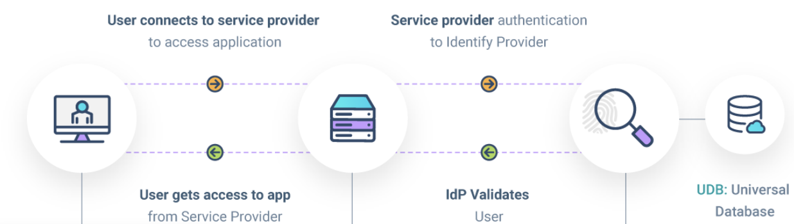

## SAML OSGI bundle for dotCMS 

### This OSGI bundle is shipped with dotCMS and can be accessed and managed using dotCMS Apps

For more information on how to configure SAML in dotCMS, see the documentation here: https://dotcms.com/docs/latest/sso-saml

### What is SAML and how it works in dotCMS?

- SAML is a protocol based on XML (Security Assertion Markup Language), do to SSO (Single Sign On)
- Users authenticate once and gain access to multiple applications without re-entering credentials.
- May handle roles and authorizations.
  
  .
- SAML could breakdown in two parts:
  - Identity Provider (IdP): This is the source of truth and it is in charge of the authentication, examples: Okta, Azure, etc.
  - Service Provider (SP): This is the app, the web site in this case dotCMS.
  
- How it works
  - Step 1: User attempts to access an SP (aka hit to dotCMS, demo.dotcms.com/dotAdmin for instance).
  - Step 2: SP redirects the user to the IdP for authentication (for instance to azure to get the login by SSO).
  - Step 3: IdP authenticates the user and creates a SAML Assertion.
  - Step 4: SAML Assertion (which is a XML) is sent back by post to the SP (dotCMS endpoint), via browser.
  - Step 5: SP validates the SAML Assertion, creates or get login the user and grants access (roles, claims, groups, etc).

### Why SAML lives in core and in a plugin?

SAML code is splitted in two repositories:
- This current repository contains all the openSAML libraries and boilerplate to interact with this library, which is in charge of creating all the Metadata XML, Authentication and Logout request, and process the IDP Assertions and so on.
- The other repository is core, and contains two main things; a) the Interceptor that catches the urls to start the SSO process b) a rest endpoint which is the place where the IDP will land the Assertion when the user gets login

Note: this repository exists because open saml introduces many libraries and dependencies, similar to Tika, we want to hide these deps from the classpath, so it is the main reason to have this separated

#### Plugin code: what is in charge of?

The plugin code is in charge of the SAML Boilerplate, means the plugin deals with the open SAML libraries, creates the Metadata XML, 
provides the methods to encrypt and decrypt, generate the XML request, process the assertion and retrieve the attributes, etc.

#### Core code: what is in charge of?

In core the SAML code is mostly related to:
- Interact with the plugin
- Intercept the url on dotCMS that does login/logout
- Provides a set of endpoints where the IDP can Post the Login/Logout Assertion and generate the Metadata
- Encapsulates the logic to create/update the user based on the configuration and the information on the assertion/attributes

#### How to set up SAML locally against Azure server (this is the only IDP we have to test against)

TBD

#### How to deploy SAML plugin changes? Steps to do it.

Daniel will fill up this section 

#### Current SAML properties that we have? And what's the function of each?

#### Explain why SAML evolution is an organic, why do we always have been reactive over customers requests.

#### Add a flow diagram of the diff SAML classes and how they interact with each other.

--------
#### Change Log:
- 25.04.28: added the ability to remove the RequestedAuthnContext from the auth

