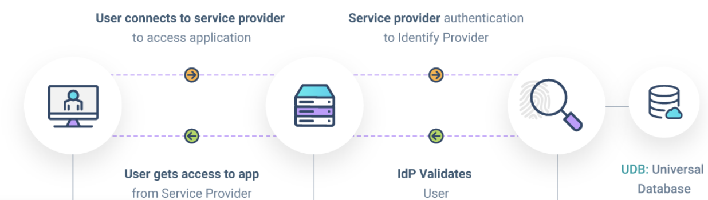

## SAML OSGI bundle for dotCMS 

### This OSGI bundle is shipped with dotCMS and can be accessed and managed using dotCMS Apps

For more information on how to configure SAML in dotCMS, see the documentation here: https://dotcms.com/docs/latest/sso-saml

### What is SAML and how it works in dotCMS?

- SAML is a protocol based on XML (Security Assertion Markup Language), do to SSO (Single Sign On)
- Users authenticate once and gain access to multiple applications without re-entering credentials.
- May handle roles and authorizations.
  
  .
- SAML could breakdown in two parts:
  - Identity Provider (IdP): This is the source of truth and it is in charge of the authentication, examples: Okta, Azure, etc.
  - Service Provider (SP): This is the app, the web site in this case dotCMS.
  
- How it works
  - Step 1: User attempts to access an SP (aka hit to dotCMS, demo.dotcms.com/dotAdmin for instance).
  - Step 2: SP redirects the user to the IdP for authentication (for instance to azure to get the login by SSO).
  - Step 3: IdP authenticates the user and creates a SAML Assertion.
  - Step 4: SAML Assertion (which is a XML) is sent back by post to the SP (dotCMS endpoint), via browser.
  - Step 5: SP validates the SAML Assertion, creates or get login the user and grants access (roles, claims, groups, etc).

### Why SAML lives in core and in a plugin?

SAML code is splitted in two repositories:
- This current repository contains all the openSAML libraries and boilerplate to interact with this library, which is in charge of creating all the Metadata XML, Authentication and Logout request, and process the IDP Assertions and so on.
- The other repository is core, and contains two main things; a) the Interceptor that catches the urls to start the SSO process b) a rest endpoint which is the place where the IDP will land the Assertion when the user gets login

Note: this repository exists because open saml introduces many libraries and dependencies, similar to Tika, we want to hide these deps from the classpath, so it is the main reason to have this separated

#### Plugin code: what is in charge of?

The plugin code is in charge of the SAML Boilerplate, means the plugin deals with the open SAML libraries, creates the Metadata XML, 
provides the methods to encrypt and decrypt, generate the XML request, process the assertion and retrieve the attributes, etc.

#### Core code: what is in charge of?

In core the SAML code is mostly related to:
- Interact with the plugin
- Intercept the url on dotCMS that does login/logout
- Provides a set of endpoints where the IDP can Post the Login/Logout Assertion and generate the Metadata
- Encapsulates the logic to create/update the user based on the configuration and the information on the assertion/attributes

#### How to set up SAML locally against Azure server (this is the only IDP we have to test against)

TBD

#### How to deploy SAML plugin changes? Steps to do it.

Daniel will fill up this section 

#### Current SAML properties that we have? And what's the function of each?

- assertion.resolver.handler.classname: in case you want to override the AssertionResolverHandler (probably not) you can set here the classpath of the class
- authn.protocol.binding: The binding for the auth request XML, such as Http-Redirect, Http-POST, Http-POST-Raw. Based on this value will use Redirect or Post to do the authentication request from dotCMS to the IDP
- logout.service.endpoint.url: this is a callback to be called by the IDP when the logout happens on the IDP and needs to get back to dotCMS, it is usually set to "/dotAdmin/show-logout"
- logout.okta.url: okta needs a special url instead of the IDP metadata XML to get logout, this is the url used in that particular case.
- clock.skew: this is the clock skew in seconds, it is used to allow some time difference between the IDP and dotCMS servers, so if the IDP sends a SAML Assertion with a timestamp that is 5 seconds in the past, it will still be valid.
- message.life.time: this is the time in seconds that the SAML message will be valid, after this time it will be considered expired.
- auth.sign.request: this is a boolean that indicates if the SAML request should be signed or not, it is usually set to false.
- auth.signature.reference.digestmethod.algorithm: this is the algorithm used to sign the SAML request, it is usually set to "http://www.w3.org/2001/04/xmlenc#sha256".
- auth.sign.params: this is a boolean that indicates if the SAML request parameters should be signed or not, it is usually set to true.
- auth.signature.algorithm: this is the algorithm used to sign the SAML request, it is usually set to "http://www.w3.org/2001/04/xmldsig-more#rsa-sha256".
- logout.sign.request: this is a boolean that indicates if the SAML logout request should be signed or not, it is usually set to false.
- logout.signature.reference.digestmethod.algorithm: this is the algorithm used to sign the SAML logout request, it is usually set to "http://www.w3.org/2001/04/xmlenc#sha256".
- logout.sign.params: this is a boolean that indicates if the SAML logout request parameters should be signed or not, it is usually set to true.
- logout.signature.algorithm: this is the algorithm used to sign the SAML logout request, it is usually set to "http://www.w3.org/2001/04/xmldsig-more#rsa-sha256".
- location.cleanqueryparams: this is a boolean that indicates if the query parameters should be cleaned from the location URL, it is usually set to true.
- logout.protocol.binding: this is the binding for the logout request XML, such as Http-Redirect, Http-POST, Http-Okta. Based on this value will use Redirect or Post to do the logout request from dotCMS to the IDP
- verify.signature.credentials: this is a boolean that indicates if the SAML response signature should be verified or not, it is usually set to true.
- verify.signature.profile: this is the profile used to verify the SAML response signature, it is usually set to "http://www.w3.org/2001/04/xmldsig-more#rsa-sha256".
- idp.metadata.protocol: this is the protocol used to retrieve the IDP metadata, it is usually set to "urn:oasis:names:tc:SAML:2.0:protocol".
- use.encrypted.descriptor: When setting the Key Descriptor in the IDP metadata, this property indicates if the Key Descriptor should be encrypted or not, it is usually set to false.
- access.filter.values: Is a comma separeted list with exceptional cases to avoid SAML evaluation
- logout.path.values: Is a comma separated list of paths that will be recognized as a logout (fires the logout request to SAML) by default this list urls: /c/portal/logout,/dotCMS/logout,/dotsaml/request/logout,/dotAdmin/logout
- bindingtype: Used to set the binding type for the SAML request, such as Http-Redirect, Http-POST, Http-POST-Raw. Based on this value will use Redirect or Post to do the authentication/logout request from dotCMS to the IDP
- attribute.email.name: this is the mapping for the email attribute in the SAML assertion, it is usually set to "mail".
- attribute.firstname.name: this is the mapping for the first name attribute in the SAML assertion, it is usually set to "givenName".
- attribute.lastname.name: this is the mapping for the last name attribute in the SAML assertion, it is usually set to "sn".
- attribute.roles.name: this is the mapping for the roles attribute in the SAML assertion, it is usually set to "authorizations".
- additionalInfo: this key allows to do the user additionl information mapping, it is a comma separated list of key=value pairs, such as "additionalInfo=prop1,prop2|collection,prop3|json|alias-for-json".
- attribute.firstname.nullvalue: when the first name attribute is not present in the SAML assertion, this value will be used as a fallback, null by default.
- attribute.lastname.nullvalue: when the last name attribute is not present in the SAML assertion, this value will be used as a fallback, null by default.
- attribute.email.allownull: when the email attribute is not present in the SAML assertion, this value will be used as a fallback, true by default.
- saml.allow.empty.attrs: when the SAML assertion does not contain any attributes, this value will be used to allow or not the user creation, true by default. if false and not attributes are present, an exception will be thrown.
- protocol.binding: This is the actual value to fill the binding on the authentication XML request, it is usually set to "urn:oasis:names:tc:SAML:2.0:bindings:HTTP-Redirect" but it can be set to "urn:oasis:names:tc:SAML:2.0:bindings:HTTP-POST" or "urn:oasis:names:tc:SAML:2.0:bindings:HTTP-POST-Raw" depending on the IDP configuration.
- skip.request.authn.context: This is a boolean that indicates if the RequestedAuthnContext should be skipped or not, it is usually set to false. If set to true, the SAML request will not include the RequestedAuthnContext element, which can be useful for some IDPs that do not support it, usually this is set when wants to ask to credentials in some IDP, in any login.
- force.authn: This is a boolean that indicates if the SAML request should force the authentication or not, it is usually set to false. If set to true, the SAML request will include the ForceAuthn attribute, which can be useful for some IDPs that require it.
- policy.allowcreate: This is a boolean that indicates if the SAML request should allow the creation of the user or not, it is usually set to false. If set to true, the SAML request will include the AllowCreate attribute, which can be useful for some IDPs that do not support it.
- nameidpolicy.format: This is the format of the NameIDPolicy element in the SAML request, it is usually set to "urn:oasis:names:tc:SAML:1.1:nameid-format:emailAddress". This value can be changed to other formats such as "urn:oasis:names:tc:SAML:2.0:nameid-format:persistent" (default) or "urn:oasis:names:tc:SAML:2.0:nameid-format:transient" depending on the IDP configuration.
- authn.context.class.ref: This is the class reference of the AuthnContext element in the SAML request, it is usually set to "urn:oasis:names:tc:SAML:2.0:ac:classes:PasswordProtectedTransport". This value can be changed to other classes such as "urn:oasis:names:tc:SAML:2.0:ac:classes:X509" or "urn:oasis:names:tc:SAML:2.0:ac:classes:Kerberos" depending on the IDP configuration.
- authn.comparisontype: This is the comparison type of the AuthnContext element in the SAML request, it is usually set to "minimum". This value can be changed to "exact" or "maximum" or "better" depending on the IDP configuration.
- isassertion.encrypted: This is a boolean that indicates if the SAML assertion should be encrypted or not, it is usually set to false. If set to true, the SAML assertion will be encrypted using the public key of the SP, which can be useful for some IDPs that require it.
#### Explain why SAML evolution is an organic, why do we always have been reactive over customers requests.

The evolution of our SAML implementation has been organic because it started from a baseline that I designed based on best practices and common SAML flows described in the literature (e.g., handling GET/POST authentication, single logout, assertion consumption endpoints, and metadata generation/parsing).
However, as different customers started integrating with our system, each brought unique configurations, requirements, and interpretations of the SAML specification.
Some examples of areas where we had to adapt include:

    Deciding when to enforce or skip signature validation

    Supporting encrypted assertions

    Handling optional attributes like RelayState or role mappings

    Allowing empty assertions

    Flexibly consuming varied IDP metadata formats

This organic, reactive evolution was necessary because SAML, by nature, is highly flexible and allows for broad customization by each Identity Provider (IDP). Even two customers using the same IDP vendor (e.g., Okta, Azure AD) may have completely different SSO configurations.

While we’ve documented improvement points and ideas to make the implementation more proactive and configurable, the reality is that customer-specific use cases and IDP diversity drive much of the ongoing development.

#### Add a flow diagram of the diff SAML classes and how they interact with each other.

--------
#### Change Log:
- 25.04.28: added the ability to remove the RequestedAuthnContext from the auth

