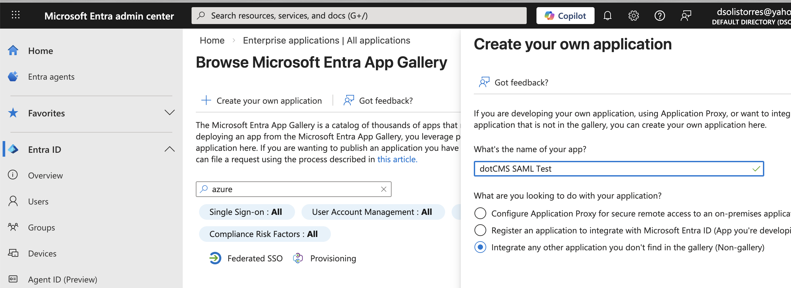
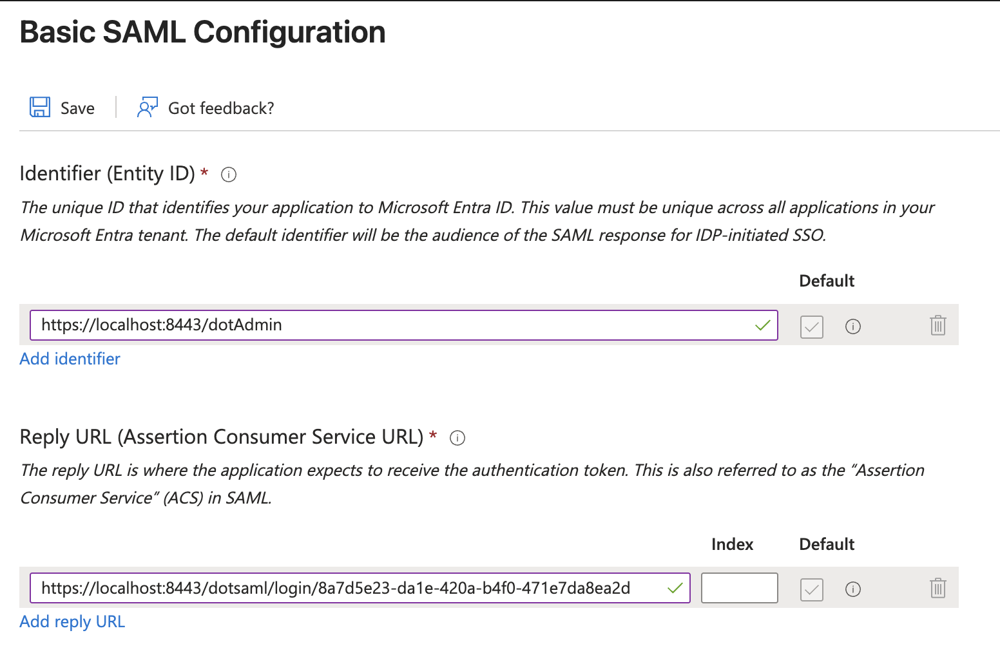
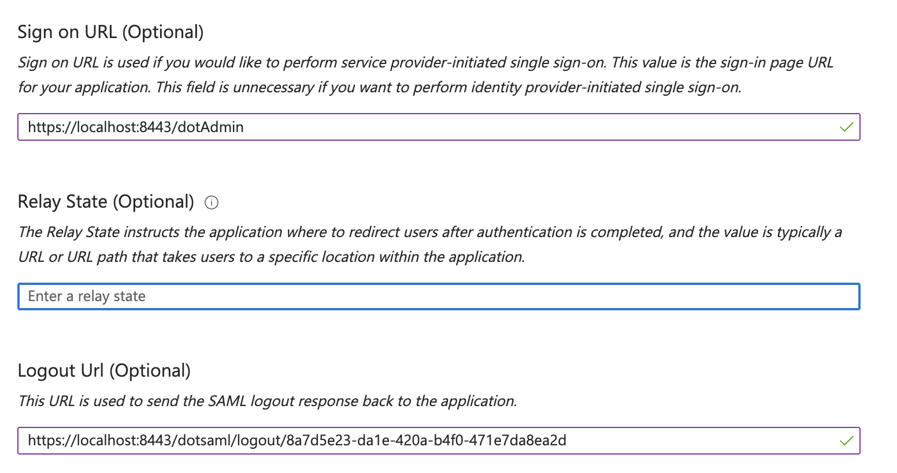
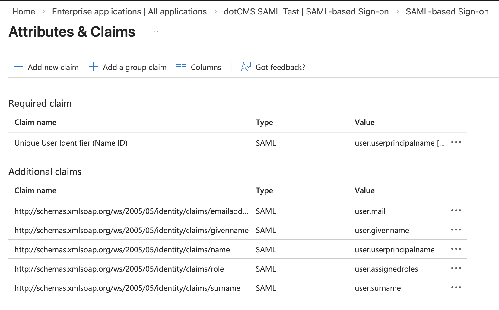
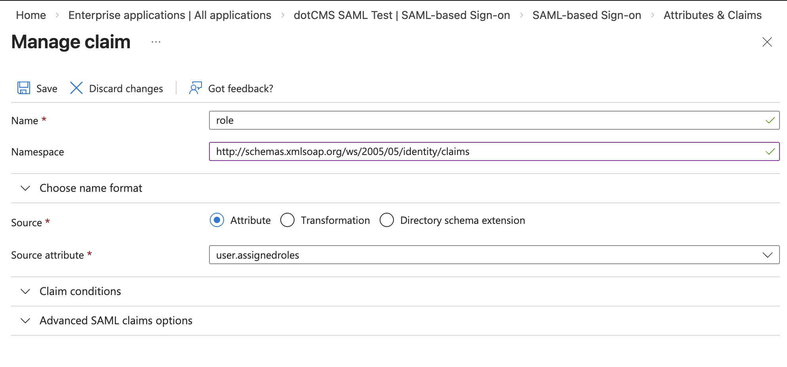
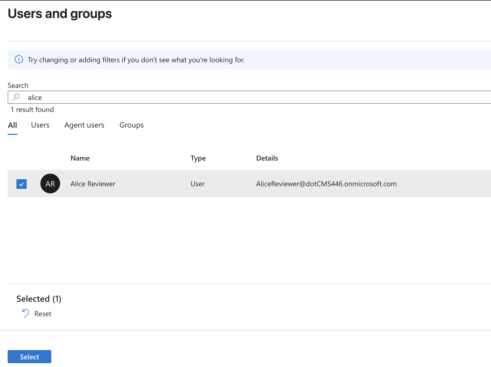
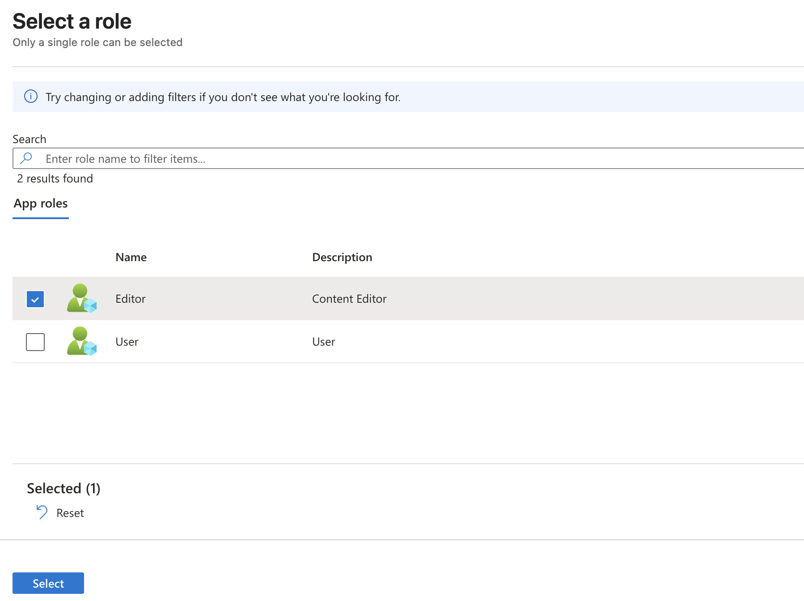

## SAML OSGI bundle for dotCMS


### This OSGI bundle is shipped with dotCMS and can be accessed and managed using dotCMS Apps

For more information on how to configure SAML in dotCMS, see the documentation here: https://dotcms.com/docs/latest/sso-saml

### What is SAML and how it works in dotCMS?

- SAML is a protocol based on XML (Security Assertion Markup Language), for SSO (Single Sign On).
- Users authenticate once and gain access to multiple applications without re-entering credentials.
- May handle roles and authorizations.

- SAML could breakdown in two parts:
  - Identity Provider (IdP): This is the source of truth and it is in charge of the authentication, examples: Okta, Azure, etc.
  - Service Provider (SP): This is the app, the web site in this case dotCMS.
  
- How it works
  - Step 1: User attempts to access an SP (aka hit to dotCMS, demo.dotcms.com/dotAdmin for instance).
  - Step 2: SP redirects the user to the IdP for authentication (for instance to azure to get the login by SSO).
  - Step 3: IdP authenticates the user and creates a SAML Assertion.
  - Step 4: SAML Assertion (which is a XML) is sent back by post to the SP (dotCMS endpoint), via browser.
  - Step 5: SP validates the SAML Assertion, creates or get login the user and grants access (roles, claims, groups, etc).


### Why SAML lives in core and in a plugin?

SAML code is splitted in two repositories:
- This current repository contains all the openSAML libraries and boilerplate to interact with this library, which is in charge of creating all the Metadata XML, Authentication and Logout request, and process the IDP Assertions and so on.
- The other repository is core, and contains two main things; a) the Interceptor that catches the urls to start the SSO process b) a rest endpoint which is the place where the IDP will land the Assertion when the user gets login

Note: this repository exists because open saml introduces many libraries and dependencies, similar to Tika, we want to hide these deps from the classpath, so it is the main reason to have this separated

#### Plugin code: what is in charge of?

The plugin code is in charge of the SAML Boilerplate, means the plugin deals with the open SAML libraries, creates the Metadata XML, 
provides the methods to encrypt and decrypt, generate the XML request, process the assertion and retrieve the attributes, etc.

#### Core code: what is in charge of?

In core the SAML code is mostly related to:
- Interact with the plugin
- Intercept the url on dotCMS that does login/logout
- Provides a set of endpoints where the IDP can Post the Login/Logout Assertion and generate the Metadata
- Encapsulates the logic to create/update the user based on the configuration and the information on the assertion/attributes

### How to set up SAML locally against Azure Entra ID server as IdP for testing

#### Prerequisites
- A dotCMS instance running locally (e.g., https://localhost:8443)
- An Azure account with admin access to Azure Entra ID (formerly Azure AD)
- The SAML plugin installed and deployed in your dotCMS instance

#### Step 1: Configure Azure Entra ID

1. **Create an Enterprise Application in Azure**
   - Log in to the Microsoft Entra Admin Center (https://entra.microsoft.com)
   - Navigate to Azure Entra ID → Enterprise Applications
   - Click "New Application" → "Create your own application"
   - Name it (e.g., "dotCMS SAML Test")
   - Select "Integrate any other application you don't find in the gallery (Non-gallery)"
   - Click "Create"




2. **Configure Single Sign-On**
   - In your newly created application, go to "Single sign-on" in the left menu
   - Select "SAML" as the single sign-on method
   - Click "Edit" on "Basic SAML Configuration"
   - Set the following values:
     - **Identifier (Entity ID)**: `https://localhost:8443/dotAdmin` (or your dotCMS URL)
     - **Reply URL (Assertion Consumer Service URL)**: `https://localhost:8443/dotsaml/login/8a7d5e23-da1e-420a-b4f0-471e7da8ea2d` 
     (replace the identifier after `/dotsaml/login/` with the identifier of the dotCMS site that will use SAML authentication)
     - **Sign on URL**: `https://localhost:8443/dotAdmin`
     - **Logout URL**: `https://localhost:8443/dotsaml/logout/8a7d5e23-da1e-420a-b4f0-471e7da8ea2d`
       (use the same site identifier used in the Reply URL after `/dotsaml/logout/`)
   - Click "Save"







3. **Configure Attributes & Claims**
   - In the SAML configuration page, click "Edit" on "Attributes & Claims"

   **Unique User Identifier (Name ID)**

   The **Unique User Identifier (Name ID)** claim is the most important claim in the SAML configuration. This is the value that dotCMS uses to uniquely identify and match users. When a user authenticates via SAML, dotCMS looks up users by this Name ID value, so it must be consistent and unique per user. By default, Entra sets this to `user.userprincipalname`, but you can change it to `user.mail` or another attribute depending on your needs.

   **Standard Attribute Claims**

   Entra uses full URI-style claim names. Ensure the following claims are configured (add if missing):

   | Entra Claim Name (URI) | Source Attribute | Description |
   |---|---|---|
   | `http://schemas.xmlsoap.org/ws/2005/05/identity/claims/emailaddress` | user.mail | User's email address |
   | `http://schemas.xmlsoap.org/ws/2005/05/identity/claims/givenname` | user.givenname | User's first name |
   | `http://schemas.xmlsoap.org/ws/2005/05/identity/claims/surname` | user.surname | User's last name |
   | `http://schemas.xmlsoap.org/ws/2005/05/identity/claims/name` | user.userprincipalname | User's display/principal name |

   These URI-style claim names are the actual values you will use in dotCMS when configuring attribute mappings (see Step 2 below).

   **Group & Role Claims**

   To assign roles to SAML users in dotCMS, you need to configure group or role claims in Entra. There are two approaches:

   - **Option A: Group ID claims** — Entra can send group Object IDs (GUIDs) in the assertion. However, these IDs are opaque and hard to match against dotCMS roles.

   - **Option B: Custom role claims (Recommended)** — Create a custom claim in Entra with a human-readable role name. This is the preferred approach because you can name the roles in Entra to match the **dotCMS Role key** directly. Since dotCMS uses the Role key to assign roles and permissions to SAML users, having the claim value match the Role key enables automatic role mapping without additional translation.

     To configure this:
     1. In "Attributes & Claims", click "Add new claim"
     2. Set a **Name** for the claim (e.g., `role` or `authorizations`)
     3. Optionally set a **Namespace** for the claim (e.g., `http://schemas.xmlsoap.org/ws/2005/05/identity/claims`)
     4. Choose the **Source** (e.g., from application roles or directory roles)
     5. Configure the values to match your dotCMS Role keys

   In dotCMS, set the `attribute.roles.name` property to match the claim name you configured in Entra.

   - Click "Save"







4. **Download the Federation Metadata XML**
   - In the SAML configuration page, scroll to "SAML Certificates"
   - Download the "Federation Metadata XML" file
   - Save it somewhere accessible (you'll need the URL or content later)

5. **Assign Users and Roles to the Application**

   **Note:** Users must already exist in your Azure Entra ID directory before they can be assigned to the application. If you need to create test users, go to Azure Entra ID → Users → "New user" and create them first.

   - Go to "Users and groups" in the left menu
   - Click "Add user/group"
   - Select users who should have access to test SAML
   - Click "Assign"

   **Configure Application Roles (if using custom role claims)**

   If you configured custom role claims in Step 3 (Option B), you need to define application roles and assign them to users:

   1. Go back to the **App Registration** (not Enterprise Application) for your app in Entra
   2. Navigate to "App roles" in the left menu
   3. Click "Create app role"
      - Set a **Display name** (e.g., "Editor")
      - Set the **Value** to match the **dotCMS Role key** exactly (e.g., `Editor` or `SAML-Editor`)
      - Select "Users/Groups" as the allowed member type
      - Click "Apply"
   4. Repeat for each role you want to map to dotCMS
   5. Go back to the **Enterprise Application** → "Users and groups"
   6. Select a user and click "Edit assignment" to assign the appropriate role(s)

   The role values you define here will be sent in the SAML assertion and matched against dotCMS Role keys, so ensure they are consistent.







#### Step 2: Configure dotCMS SAML Plugin

1. **Access the SAML Configuration in dotCMS**
   - Log in to dotCMS as an admin user
   - Navigate to System → Apps → SAML

2. **Configure the SAML Settings**
   - **Enable SAML**: Toggle to enable
   - **IDP Name**: A name for reference (e.g., "Test Entra ID")
   - **SP Issuer ID**: `https://localhost:8443/dotAdmin`
   - **SP Endpoint Hostname/Port**: `localhost:8443`
   - **Validation Type**: Select `Only Assertion` if Azure is configured to sign assertions only (default).
     If your Entra application is configured to sign the entire SAML **Response** (not just the assertion), select `Both Response and Assertion` or `Only Response` accordingly.
   - **Public Certificate / Private Key**: Generate a public/private key pair for dotCMS SAML. This key pair is used by the SP (dotCMS) to sign authentication requests and decrypt encrypted assertions. You can generate one using:
     ```bash
     openssl req -x509 -newkey rsa:2048 -keyout saml-key.pem -out saml-cert.pem -days 365 -nodes
     ```
     Paste the certificate and private key contents into the corresponding fields.
   - **IdP Metadata URL**: Paste the Azure Federation Metadata XML URL from Step 1.4
     - Example: `https://login.microsoftonline.com/{tenant-id}/federationmetadata/2007-06/federationmetadata.xml?appid={app-id}`
   - **Attribute Mappings** — Use the following custom configuration property names and set them to the Entra claim URIs:
     - `attribute.email.name`: `http://schemas.xmlsoap.org/ws/2005/05/identity/claims/emailaddress`
     - `attribute.firstname.name`: `http://schemas.xmlsoap.org/ws/2005/05/identity/claims/givenname`
     - `attribute.lastname.name`: `http://schemas.xmlsoap.org/ws/2005/05/identity/claims/surname`
     - `attribute.roles.name`: `http://schemas.xmlsoap.org/ws/2005/05/identity/claims/role`
   - **Protocol Binding**: Select `HTTP-POST`. The configuration property for this is `authn.protocol.binding`, which controls the transport mechanism used to send the authentication request to the IDP.
   - **Role Extra**: Set the custom property `role.extra` to `DOTCMS_BACK_END_USER` so that SAML-authenticated users are granted back-end access to dotCMS.
   - Save the configuration

3. **Additional Configuration Properties** (if needed)
   - You may need to set these additional properties in your dotCMS configuration:
     ```
     dotcms.saml.force.authn=false
     dotcms.saml.policy.allowcreate=true
     dotcms.saml.nameidpolicy.format=urn:oasis:names:tc:SAML:1.1:nameid-format:emailAddress
     dotcms.saml.authn.comparisontype=exact
     dotcms.saml.authn.protocol.binding=urn:oasis:names:tc:SAML:2.0:bindings:HTTP-POST
     ```

   > **Note on `authn.protocol.binding` vs `protocol.binding`:** The `authn.protocol.binding` property controls which transport handler dotCMS uses to **send** the authentication request to the IDP (e.g., HTTP-Redirect or HTTP-POST). The `protocol.binding` property sets the `ProtocolBinding` attribute in the AuthnRequest XML, telling the IDP which binding to use for the **response** back to dotCMS.
   >
   > However, `protocol.binding` is only relevant when using the `Http-Redirect` handler. When `authn.protocol.binding` is set to `Http-POST`, the POST handler hardcodes the response binding to `HTTP-POST` in the AuthnRequest XML, so `protocol.binding` is ignored. This means `protocol.binding` only matters in the redirect scenario — for example, if you want to send the request via redirect but have the IDP respond via POST.
   >
   > For Entra with `HTTP-POST`, setting `authn.protocol.binding=Http-POST` is sufficient.

   > **Important — Entra ID requires `exact` comparison:** By default, dotCMS sets the `RequestedAuthnContext` comparison to `minimum`, but Azure Entra ID requires it to be `exact`. If you don't set `dotcms.saml.authn.comparisontype=exact`, you will get the following error:
   >
   > `AADSTS900235: SAML authentication request's RequestedAuthenticationContext Comparison value must be 'exact'. Received value: 'Minimum'.`
   >
   > This cannot be changed on the Entra side — it must be configured in dotCMS.

#### Step 3: Test the SAML Configuration

1. **Initiate SP-Initiated Login**
   - Open a new incognito/private browser window
   - Navigate to `https://localhost:8443/dotAdmin`
   - You should be redirected to the Azure login page
   - Log in with a user that has been assigned to the application
   - After successful authentication, you should be redirected back to dotCMS and logged in

2. **Verify User Creation**
   - Check that the user was created in dotCMS with the correct attributes
   - Navigate to System → Users to verify

3. **Test Logout**
   - Click logout in dotCMS
   - Verify that you are logged out from both dotCMS and Azure

#### Troubleshooting Tips

- **Check dotCMS logs**: Look in `dotserver/tomcat-X.X.X/webapps/ROOT/dotsecure/logs/` for SAML-related errors
- **Enable debug logging**: Add the following `Logger` elements to your `log4j2.xml` configuration to enable verbose SAML logging:
  ```xml
  <!-- SAML plugin (OpenSAML boilerplate, assertion processing) -->
  <Logger name="com.dotcms.saml" level="DEBUG" />
  <!-- SAML REST endpoints (login/logout/metadata) -->
  <Logger name="com.dotcms.auth.providers.saml.v1" level="DEBUG" />
  <!-- SAML web interceptor (URL interception for SSO) -->
  <Logger name="com.dotcms.filters.interceptor.saml" level="DEBUG" />
  ```
- **Common Issues**:
  - **Signature validation errors**: Ensure Azure is configured to sign assertions and dotCMS has the correct certificate
  - **Attribute mapping errors**: Verify the attribute names match exactly between Azure and dotCMS
  - **Redirect URI mismatch**: Ensure the Reply URL in Azure matches the ACS URL in dotCMS exactly
  - **Clock skew issues**: Adjust the `clock.skew` property if you see timestamp validation errors

### How to deploy SAML plugin changes? Steps to deploy the plugin.

The SAML plugin is a **system plugin** in dotCMS — it is already included in the dotCMS Docker image and is deployed automatically on startup. Users do not deploy the plugin directly. When changes are made to the plugin, the process involves building and testing with a SNAPSHOT version first, then publishing a release version to the dotCMS artifact repository and updating the version reference in dotCMS core.

#### Prerequisites
- JDK 21 or higher installed
- Maven 3.9+ installed (or use the Maven wrapper included in the project)
- Git access to this repository
- Access to the dotCMS core repository
- A user account with deploy permissions to the dotCMS Maven repository (https://repo.dotcms.com/artifactory/) — only needed for publishing release versions or sharing snapshots with other developers

#### Step 1: Build the SAML Plugin

1. **Clone the repository** (if you haven't already)
   ```bash
   git clone https://github.com/dotCMS/com.dotcms.dotsaml.git
   cd com.dotcms.dotsaml
   ```

2. **Make your changes** to the plugin as needed

3. **Set a SNAPSHOT version** in the `pom.xml` file:
   ```xml
   <version>26.03.17-SNAPSHOT</version>
   ```
   Using a SNAPSHOT version is the standard practice when working across multiple artifacts (plugin + dotCMS app) simultaneously. It signals that this is a development version under active testing.

4. **Build the plugin JAR**
   ```bash
   ./mvnw clean package -DskipTests
   ```

5. **Verify the build**
   - The build produces a single bundle JAR in `target/`:
     - The **plugin JAR** (`com.dotcms.samlbundle-X.X.X-SNAPSHOT.jar`)
   - Starting with dotCMS 26.x, plugins use exported packages instead of fragments, so no separate fragment JAR is needed.

#### Step 2: Install the SNAPSHOT Locally and Test

For local development, you do **not** need to deploy the SNAPSHOT to the remote repository. Install it to your local Maven repository instead:

```bash
./mvnw install -DskipTests
```

Then, in the dotCMS core repository, update the SAML plugin dependency in `osgi-base/system-bundles/pom.xml` to use the SNAPSHOT version:

```xml
<dependency>
    <groupId>com.dotcms</groupId>
    <artifactId>com.dotcms.samlbundle</artifactId>
    <version>26.03.17-SNAPSHOT</version>
    <scope>provided</scope>
</dependency>
```

Now build and run your dotCMS instance locally to test:

1. Build a dotCMS Docker image from your local core branch (which now references the SNAPSHOT version)
2. Navigate to System → Apps → SAML and verify the configuration page loads correctly
3. Perform a test SAML login to verify the plugin changes work as expected
4. Review logs for any SAML-related errors

> **Tip:** If other developers need to test the same SNAPSHOT, you can deploy it to the remote repository using the snapshot repository URL (`https://repo.dotcms.com/artifactory/libs-snapshot`). Otherwise, local installation is sufficient for individual development.

#### Step 3: Publish the Release Version

Once your changes are tested and working, create the release version:

1. **Update the version** in `pom.xml` to remove the `-SNAPSHOT` suffix:
   ```xml
   <version>26.03.17</version>
   ```

2. **Rebuild the plugin JAR**
   ```bash
   ./mvnw clean package -DskipTests
   ```

3. **Configure your Maven credentials** (if not already done)

   Add an entry for `dotcms-libs` in your `~/.m2/settings.xml` file. It is recommended to use a token instead of your actual password (you can generate a token from the user profile in the repository site):
   ```xml
   <settings>
     <servers>
       <server>
         <id>dotcms-libs</id>
         <username>{{username}}</username>
         <password>{{user-token}}</password>
       </server>
     </servers>
   </settings>
   ```

4. **Deploy the release JAR** to the dotCMS artifact repository:
   ```bash
   mvn deploy:deploy-file \
     -DgroupId=com.dotcms \
     -DartifactId=com.dotcms.samlbundle \
     -Dversion=26.03.17 \
     -Dpackaging=jar \
     -Dfile=target/com.dotcms.samlbundle-26.03.17.jar \
     -DrepositoryId=dotcms-libs \
     -Durl=https://repo.dotcms.com/artifactory/libs-release
   ```

#### Step 4: Update the Plugin Version in dotCMS Core and Create a Pull Request

1. **Update the version** in the dotCMS core repository's `osgi-base/system-bundles/pom.xml` to point to the release version:
   ```xml
   <version>26.03.17</version>
   ```

2. **Commit your change** to a feature branch in the core repository

3. **Create a Pull Request** in the dotCMS core repository to merge the version update to main. Include in the PR description what changed in the plugin and a link to the plugin commit/PR for reference

### Current SAML properties that we have? And what's the function of each?

- assertion.resolver.handler.classname: in case you want to override the AssertionResolverHandler (probably not) you can set here the classpath of the class
- authn.protocol.binding: The binding for the auth request XML, such as Http-Redirect, Http-POST, Http-POST-Raw. Based on this value will use Redirect or Post to do the authentication request from dotCMS to the IDP
- logout.service.endpoint.url: this is a callback to be called by the IDP when the logout happens on the IDP and needs to get back to dotCMS, it is usually set to "/dotAdmin/show-logout"
- logout.okta.url: okta needs a special url instead of the IDP metadata XML to get logout, this is the url used in that particular case.
- clock.skew: this is the clock skew in seconds, it is used to allow some time difference between the IDP and dotCMS servers, so if the IDP sends a SAML Assertion with a timestamp that is 5 seconds in the past, it will still be valid.
- message.life.time: this is the time in seconds that the SAML message will be valid, after this time it will be considered expired.
- auth.sign.request: this is a boolean that indicates if the SAML request should be signed or not, it is usually set to false.
- auth.signature.reference.digestmethod.algorithm: this is the algorithm used to sign the SAML request, it is usually set to "http://www.w3.org/2001/04/xmlenc#sha256".
- auth.sign.params: this is a boolean that indicates if the SAML request parameters should be signed or not, it is usually set to true.
- auth.signature.algorithm: this is the algorithm used to sign the SAML request, it is usually set to "http://www.w3.org/2001/04/xmldsig-more#rsa-sha256".
- logout.sign.request: this is a boolean that indicates if the SAML logout request should be signed or not, it is usually set to false.
- logout.signature.reference.digestmethod.algorithm: this is the algorithm used to sign the SAML logout request, it is usually set to "http://www.w3.org/2001/04/xmlenc#sha256".
- logout.sign.params: this is a boolean that indicates if the SAML logout request parameters should be signed or not, it is usually set to true.
- logout.signature.algorithm: this is the algorithm used to sign the SAML logout request, it is usually set to "http://www.w3.org/2001/04/xmldsig-more#rsa-sha256".
- location.cleanqueryparams: this is a boolean that indicates if the query parameters should be cleaned from the location URL, it is usually set to true.
- logout.protocol.binding: this is the binding for the logout request XML, such as Http-Redirect, Http-POST, Http-Okta. Based on this value will use Redirect or Post to do the logout request from dotCMS to the IDP
- verify.signature.credentials: this is a boolean that indicates if the SAML response signature should be verified or not, it is usually set to true.
- verify.signature.profile: this is the profile used to verify the SAML response signature, it is usually set to "http://www.w3.org/2001/04/xmldsig-more#rsa-sha256".
- idp.metadata.protocol: this is the protocol used to retrieve the IDP metadata, it is usually set to "urn:oasis:names:tc:SAML:2.0:protocol".
- use.encrypted.descriptor: When setting the Key Descriptor in the IDP metadata, this property indicates if the Key Descriptor should be encrypted or not, it is usually set to false.
- access.filter.values: Is a comma separeted list with exceptional cases to avoid SAML evaluation
- logout.path.values: Is a comma separated list of paths that will be recognized as a logout (fires the logout request to SAML) by default this list urls: /c/portal/logout,/dotCMS/logout,/dotsaml/request/logout,/dotAdmin/logout
- bindingtype: Used to set the binding type for the SAML request, such as Http-Redirect, Http-POST, Http-POST-Raw. Based on this value will use Redirect or Post to do the authentication/logout request from dotCMS to the IDP
- attribute.email.name: this is the mapping for the email attribute in the SAML assertion, it is usually set to "mail".
- attribute.firstname.name: this is the mapping for the first name attribute in the SAML assertion, it is usually set to "givenName".
- attribute.lastname.name: this is the mapping for the last name attribute in the SAML assertion, it is usually set to "sn".
- attribute.roles.name: this is the mapping for the roles attribute in the SAML assertion, it is usually set to "authorizations".
- additionalInfo: this key allows to do the user additionl information mapping, it is a comma separated list of key=value pairs, such as "additionalInfo=prop1,prop2|collection,prop3|json|alias-for-json".
- attribute.firstname.nullvalue: when the first name attribute is not present in the SAML assertion, this value will be used as a fallback, null by default.
- attribute.lastname.nullvalue: when the last name attribute is not present in the SAML assertion, this value will be used as a fallback, null by default.
- attribute.email.allownull: when the email attribute is not present in the SAML assertion, this value will be used as a fallback, true by default.
- saml.allow.empty.attrs: when the SAML assertion does not contain any attributes, this value will be used to allow or not the user creation, true by default. if false and not attributes are present, an exception will be thrown.
- protocol.binding: This is the actual value to fill the binding on the authentication XML request, it is usually set to "urn:oasis:names:tc:SAML:2.0:bindings:HTTP-Redirect" but it can be set to "urn:oasis:names:tc:SAML:2.0:bindings:HTTP-POST" or "urn:oasis:names:tc:SAML:2.0:bindings:HTTP-POST-Raw" depending on the IDP configuration.
- skip.request.authn.context: This is a boolean that indicates if the RequestedAuthnContext should be skipped or not, it is usually set to false. If set to true, the SAML request will not include the RequestedAuthnContext element, which can be useful for some IDPs that do not support it, usually this is set when wants to ask to credentials in some IDP, in any login.
- force.authn: This is a boolean that indicates if the SAML request should force the authentication or not, it is usually set to false. If set to true, the SAML request will include the ForceAuthn attribute, which can be useful for some IDPs that require it.
- policy.allowcreate: This is a boolean that indicates if the SAML request should allow the creation of the user or not, it is usually set to false. If set to true, the SAML request will include the AllowCreate attribute, which can be useful for some IDPs that do not support it.
- nameidpolicy.format: This is the format of the NameIDPolicy element in the SAML request, it is usually set to "urn:oasis:names:tc:SAML:1.1:nameid-format:emailAddress". This value can be changed to other formats such as "urn:oasis:names:tc:SAML:2.0:nameid-format:persistent" (default) or "urn:oasis:names:tc:SAML:2.0:nameid-format:transient" depending on the IDP configuration.
- authn.context.class.ref: This is the class reference of the AuthnContext element in the SAML request, it is usually set to "urn:oasis:names:tc:SAML:2.0:ac:classes:PasswordProtectedTransport". This value can be changed to other classes such as "urn:oasis:names:tc:SAML:2.0:ac:classes:X509" or "urn:oasis:names:tc:SAML:2.0:ac:classes:Kerberos" depending on the IDP configuration.
- authn.comparisontype: This is the comparison type of the AuthnContext element in the SAML request, it is usually set to "minimum". This value can be changed to "exact" or "maximum" or "better" depending on the IDP configuration.
- isassertion.encrypted: This is a boolean that indicates if the SAML assertion should be encrypted or not, it is usually set to false. If set to true, the SAML assertion will be encrypted using the public key of the SP, which can be useful for some IDPs that require it.

### Why SAML evolution is organic, and has been reactive

The evolution of our SAML implementation has been organic because it started from a baseline that was designed based on best practices and common SAML flows described in the literature (e.g., handling GET/POST authentication, single logout, assertion consumption endpoints, and metadata generation/parsing).
However, as different customers started integrating with our system, each brought unique configurations, requirements, and interpretations of the SAML specification.
Some examples of areas where we had to adapt include:

    Deciding when to enforce or skip signature validation

    Supporting encrypted assertions

    Handling optional attributes like RelayState or role mappings

    Allowing empty assertions

    Flexibly consuming varied IDP metadata formats

This organic, reactive evolution was necessary because SAML, by nature, is highly flexible and allows for broad customization by each Identity Provider (IDP). Even two customers using the same IDP vendor (e.g., Okta, Azure AD) may have completely different SSO configurations.

While we’ve documented improvement points and ideas to make the implementation more proactive and configurable, the reality is that customer-specific use cases and IDP diversity drive much of the ongoing development.

### Flow diagram of the diff SAML classes and how they interact with each other


#### Change Log:
- 26.03.17: migrated from Gradle to Maven, Java 21, removed fragment JAR generation
- 25.04.28: added the ability to remove the RequestedAuthnContext from the auth

